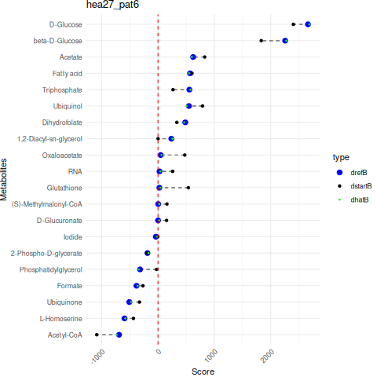

# The *metabolic potential embeddings* represent metabolic activities of each person’s gut microbial community

## How to build the *metabolic potential embeddings*

Exciting documentation here.
Main steps:

- item 1

  - nested item 1
  - nested item 2

- item 2
- item 3
- item 4

## Deriving *metabolic potential embeddings* for the Wirbel's cohort

## Exploring *metabolic potential embeddings* or the Wirbel's cohort in the PCA space

### Differential coloring of healthy and diseased individuals and ground truth loadings drawing

